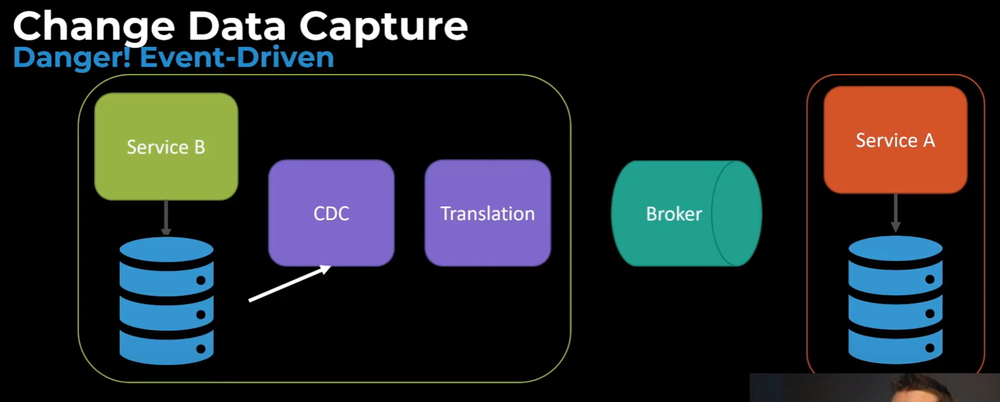

# basic events
## Meta data
- Originator identifier
- business flow ID

## Requirements for aa basic event
- Idempotency

## Deadleter queues

##  poisoned message/pill

# Domain events

Thoughts:
- always end processing a domain event with a "domain event completed" ?
  - https://youtu.be/gIL8rW_eyww?list=PLX8B_NHisgeUInqqu7Tlrh6NeGg9jguMQ&t=838

# CDC events
https://www.youtube.com/watch?v=ARWNnnDGPag&list=PLX8B_NHisgeUInqqu7Tlrh6NeGg9jguMQ&index=4&ab_channel=CodeOpinion

- CUD type events
    - Create
    - Update
    - Delete

Sagas (Choreography & compensational actions)